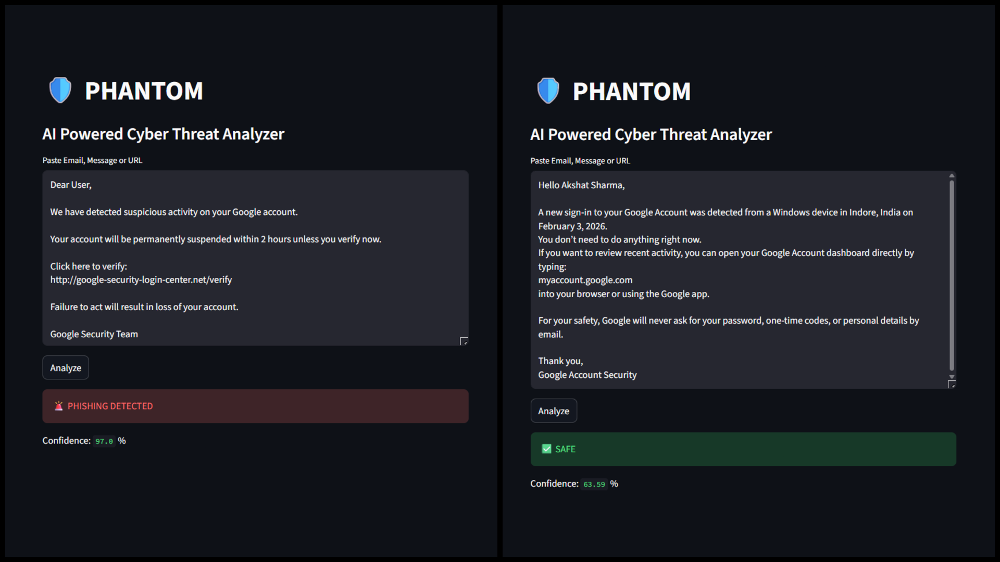
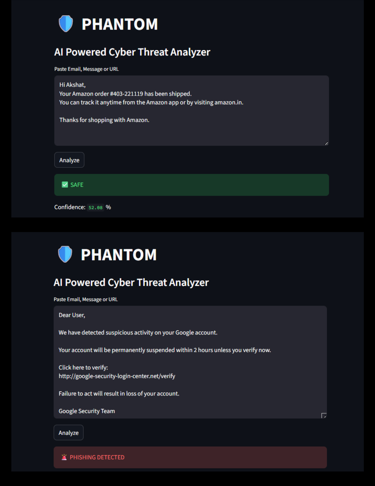
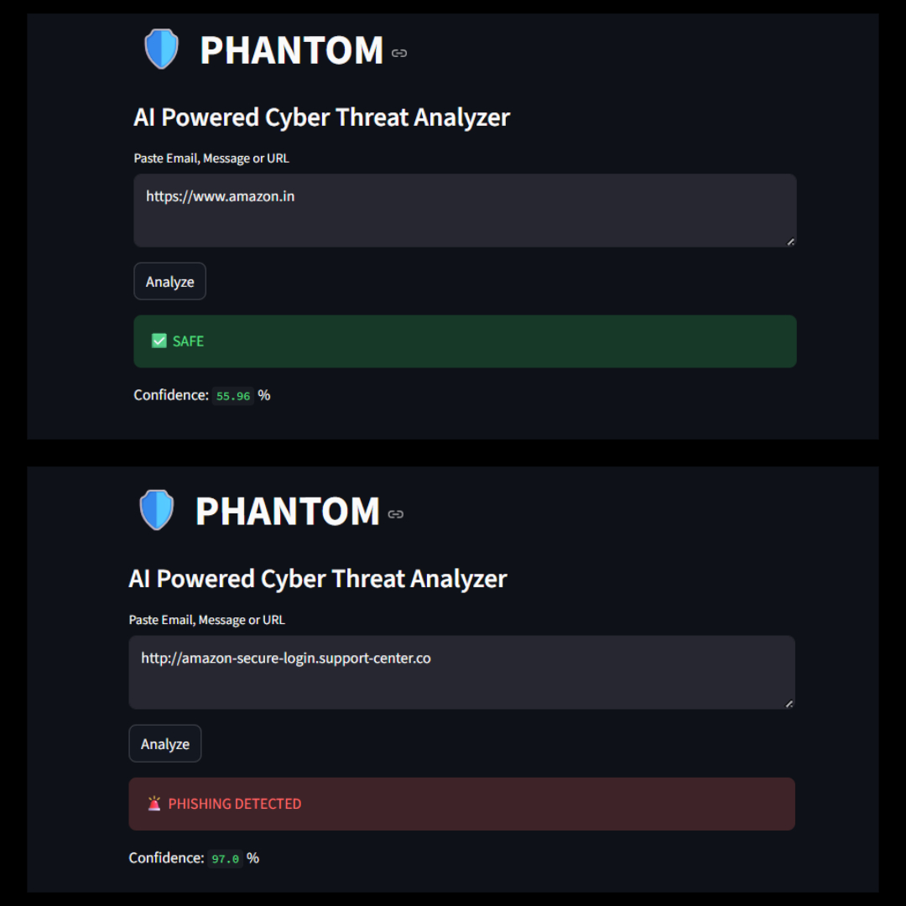

# 🛡️ PHANTOM – AI Powered Cyber Threat & Phishing Detection System

PHANTOM is a **hybrid AI + Cyber-Intelligence based phishing detection engine** designed to analyze messages, emails, and URLs in real time and detect modern phishing attacks using **machine learning, domain intelligence, infrastructure analysis, and brand-spoof detection**.

Unlike basic ML models that rely only on text, PHANTOM simulates how **real security products** (like Google Safe Browsing or enterprise firewalls) think by combining **AI + cyber signals**.

---    

## 🚀 Why PHANTOM is different


Most phishing projects do this:

> “Train ML model → Predict phishing”

PHANTOM does this:

> **AI + Domain age + SSL + Hosting ASN + IP reputation + Brand spoofing + URL structure → Final decision**

That’s how **real cyber-security engines** work.

---

## 🧠 System Architecture

PHANTOM uses a **multi-layer decision pipeline**:

```
User Input (Email / Message / URL)
        ↓
NLP Model (BERT)
        ↓
Cyber Rule Engine
        ↓
Domain + IP + Hosting Intelligence
        ↓
Brand Spoof Detection
        ↓
Final Risk Score
        ↓
SAFE / PHISHING
```

No single signal is trusted blindly.

---

## 🔍 What PHANTOM analyzes

| Layer              | What it checks                                |
| ------------------ | --------------------------------------------- |
| 🧠 NLP             | Message tone, urgency, scam language          |
| 🔗 URL Scanner     | Suspicious URL structure                      |
| 🌐 Domain Intel    | Domain age, trust, SSL                        |
| 🖥 IP Intel        | IP abuse & hosting reputation                 |
| 🏢 ASN Intel       | Is it hosted on shady networks                |
| 🎭 Brand Intel     | Fake Amazon, Microsoft, Bank URLs             |
| 🛡 Trusted Domains | Protects real sites like Google, HDFC, GitHub |

---

## ⚙️ Technologies Used

* **Python**
* **PyTorch**
* **HuggingFace Transformers (BERT)**
* **Streamlit (UI)**
* **Requests**
* **Cyber-intelligence rule engine**

---

## 📦 Project Structure

```
PHANTOM/
│
├── app.py                     → Streamlit Web App
├── requirements.txt
├── data/
│   └── phishing.csv           → Training data
│
├── training/
│   └── train.py               → Model training
│
└── utils/
    ├── predict.py             → Core AI decision engine
    ├── cyber_rules.py         → NLP & keyword scoring
    ├── url_scanner.py         → URL pattern analysis
    ├── domain_intel.py        → Domain age & SSL
    ├── domain_reputation.py   → Domain trust
    ├── ip_intel.py            → IP abuse detection
    ├── hosting_intel.py       → ASN & hosting risk
    ├── brand_intel.py         → Brand spoof detection
    ├── trusted_domains.py    → Whitelisted sites
    └── threat_intel.py        → Known phishing feeds
```

---

## 🧪 How to Run

```bash
pip install -r requirements.txt
streamlit run app.py
```

Then open:

```
http://localhost:8501
```

---

## 🧠 How PHANTOM makes decisions

PHANTOM doesn’t blindly trust AI.

It calculates:

```
Final Risk = NLP Score
           + URL Risk
           + Domain Trust
           + Domain Age
           + SSL Strength
           + IP Abuse
           + Hosting ASN Risk
           + Brand Spoof Score
```

If this crosses a threshold → **PHISHING**

If not → **SAFE**

---

## ⚠️ Why some fake sites may appear safe

Some phishing domains are:

* Newly registered
* Not yet reported
* Have SSL
* Hosted on clean infrastructure

Even Google & VirusTotal detect them **after users get scammed**.

PHANTOM correctly reflects this real-world limitation — making it **realistic, not fake-perfect**.

---

## 📸 Screenshots

These examples demonstrate how PHANTOM analyzes different types of cyber inputs in real time.

### 📧 Email Analysis
This example shows how PHANTOM inspects the structure, language, and embedded signals in an email to decide whether it is safe or a phishing attempt.



---

### 💬 Message Analysis
PHANTOM evaluates text messages using NLP and cyber-rules to detect urgency, manipulation, and social-engineering patterns.



---

### 🌐 URL Analysis
Here PHANTOM analyzes a URL using domain reputation, SSL, domain age, and infrastructure risk to detect malicious or fake websites.



---

## 👨‍💻 Author

**Akshat Sharma**
B.Tech CSE | Cyber-AI Developer
GitHub: [https://github.com/ThisAkshat](https://github.com/ThisAkshat)


